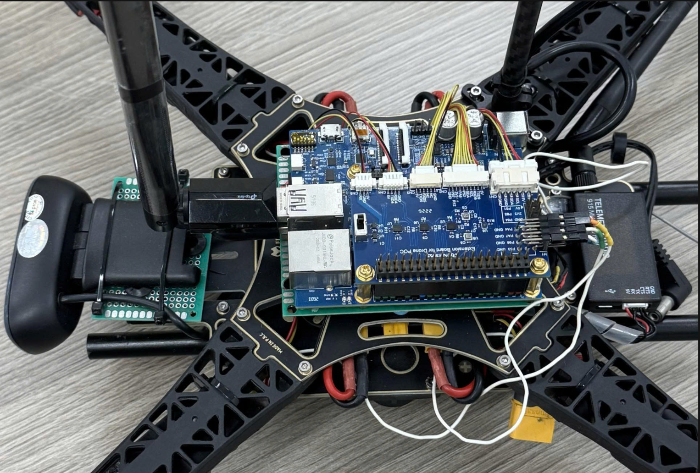

# Hardware Guide

Complete bill of materials, 40-pin GPIO pinout, and wiring for the RZ/V2H autonomous drone.

---

## Bill of Materials


| Component | Model | Qty | Notes |
|-----------|-------|-----|-------|
| **Flight Controller** | Renesas RZ/V2H RDK | 1 | Cortex-R8 (FreeRTOS/PX4) + Cortex-A55 (Linux/ROS2) |
| **Frame (Recommended)** | LX450 | 1 | Better RDK mounting compatibility |
| **Frame (Optional)** | S500 | 1 | Top plate alignment issues with RDK |
| **GPS** | u-blox M10 | 1 | UART 9600 baud (up to 18 Hz update) |
| **Sensor Extension Board** | RDK Extension Board (schematic SCH-20260713) | 1 | Custom PCB — carries all IMU/mag/baro/battery-monitor sensors + GPS/telemetry/TFmini/ESC/fs-a8s connectors, plugs onto the RDK 40-pin header |
| **IMU** | ICM-45686 ×3 | 3 | SPI, polled mode, one shared bus (`icm45686 -c 1/2/3`); replaces single MPU9250 |
| **Magnetometer** | BMM150 | 1 | I2C7 @ 0x10, primary mag; replaces MPU9250's internal AK8963 |
| **Barometer** | BMP390L | 1 | I2C7 @ 0x77 (bmp388 driver); replaces BMP280. **Do not substitute ICP-20100** — see note below |
| **LiDAR** | TFmini Plus | 1 | UART, primary altitude (0.1–12 m range) |
| **Telemetry** | Sik V3 433/915 MHz | 1 | MAVLink @ 57600 baud to QGC |
| **RC Receiver** | FlySky fs-a8s | 1 | SBUS (requires inverter circuit) |
| **Propeller (Recommended)** | 9450 | 4 | For LX450 frame |
| **Propeller (Optional)** | 1045 | 4 | For S500 frame |
| **ESC** | SkyWalker 40A | 4 | Electronic speed controllers |
| **Motor** | Sunny Sky X2216 1100kV | 4 | Brushless DC |
| **Camera** | Logitech C920 (USB) | 1 | CA55/Linux vision sensor |
| **Power Module** | Holybro PM03D | 1 | Power distribution + 5V regulator + INA228 battery monitor (I2C7 @ 0x45, CLIK-Mate connector) |
| **LiPo Battery** | 4S 5300mAh | 1 | Main power source |
| **Charger** | IMAX B6 (6A discharger) | 1 | Balance charging |
| **SBUS Inverter** | C1815 NPN transistor | 1 | Signal inversion for RC receiver |
| **Mounting Hardware** | M2.5/M3 standoffs | 1 set | Board spacing and mounting |

---

## RDK Board Overview


| Interface | Location | Usage |
|-----------|----------|-------|
| **40-pin GPIO Header** | Top edge (RPi-compatible) | All sensor I/O |
| **UART Serial** | Edge | Debug console |
| **USB** | Rear | Firmware update, logs |
| **SD Card** | Rear | U-Boot, Linux rootfs, flight logs |
| **JTAG** | Center | J-Link debugging (SEGGER RTT) |

---

## 40-Pin GPIO Pinout


**Connected pins only:**

| Pin # | RPi Label | Peripheral |
|-------|-----------|-----------|
| **3** | GPIO02/SDA | **I2C7 SDA** — shared bus: BMM150 mag (0x10), BMP390L baro (0x77), INA228 battery monitor (0x45) |
| **5** | GPIO03/SCL | **I2C7 SCL** — same shared bus as above |
| **7** | GPIO04 | **fs-a8s RX** (UART6) |
| **8** | GPIO14/TXD | **Sik TX** (UART5) |
| **10** | GPIO15/RXD | **Sik RX** (UART5) |
| **13** | GPIO27 | **TFmini TX** (UART4) |
| **15** | GPIO22 | **TFmini RX** (UART4) |
| **16** | GPIO23 | **GPS RX** (UART9) |
| **18** | GPIO24 | **GPS TX** (UART9) |
| **19** | GPIO10/MOSI | **SPI0 MOSI** — shared by all 3× ICM-45686 |
| **21** | GPIO09/MISO | **SPI0 MISO** — shared by all 3× ICM-45686 |
| **22** | GPIO25 | **ICM-45686 #1 INT1** — wired but unused (driver runs polled, `-P`) |
| **23** | GPIO11/SCK | **SPI0 SCK** — shared by all 3× ICM-45686 |
| **24** | GPIO08/CE0 | **SPI0 CS0** — ICM-45686 #1 chip-select (`-c 1`) |
| **31** | GPIO06 | **ESC4 PWM** (GPT10B) |
| **32** | GPIO12/PWM0 | **ESC1 PWM** (GPT6A) |
| **33** | GPIO13/PWM1 | **ESC2 PWM** (GPT7B) |
| **35** | GPIO19/PCM_FS | **ESC3 PWM** (GPT9A) |

Chip-selects for IMU #2 (`-c 2`) and IMU #3 (`-c 3`) are the extension board's SSLA1/SSLA2 lines
(SoC pins P94/P95) — see the schematic (`Extension board for drone_SCH-20260713.pdf`) for their
exact position on the 40-pin connector; not re-derived here to avoid mis-stating a physical pin
number from source that wasn't fully verifiable.

**UART mapping:**
- UART4 (P70/P71): TFmini → `/dev/ttyS4`
- UART5 (P72/P73): Sik Telemetry → `/dev/ttyS5`
- UART6 RX (P75): fs-a8s (SBUS) → `/dev/ttyS6`
- UART9 (P82/P83): GPS M10 → `/dev/ttyS9`

---

## Wiring


### Key Connections

The extension board plugs onto the RDK 40-pin header as a single unit — the connections below
describe what the extension board wires internally, not hand-soldered jumpers.

**IMU array (3× ICM-45686) – SPI0:**
```
VCC→+3V3, GND→GND, SCK→Pin23, MOSI→Pin19, MISO→Pin21
CS_IMU1→Pin24 (SSLA0), CS_IMU2→SSLA1 (P94), CS_IMU3→SSLA2 (P95)
INT1 of IMU#1 → Pin22, wired but unused (polled mode)
```

**Mag + Baro + Battery monitor – I2C7 (shared bus):**
```
VCC→+3V3 (BMM150/BMP390L) or PM03D CLIK-Mate (INA228), GND→GND, SDA→Pin3, SCL→Pin5
BMM150 @0x10, BMP390L @0x77, INA228 @0x45
```

**GPS M10 – UART:**
```
VCC→PM03D 5V, GND→GND, TX→Pin18, RX→Pin16
```

**TFmini Plus – UART:**
```
VCC→PM03D 5V, GND→GND, TX→Pin13, RX→Pin15
```

**Sik Telemetry V3 – UART:**
```
VCC→PM03D 5V, GND→GND, TX→Pin10, RX→Pin8
```

**RC Receiver (fs-a8s) – SBUS + Inverter:**
```
SBUS OUT → [NPN inverter] → Pin7 (RDK UART6)
```

**ESC PWM:**
```
ESC1→Pin32, ESC2→Pin33, ESC3→Pin35, ESC4→Pin31, GND→Pin34
```

> **Motor order**: PX4 X-configuration — Motor 1 (front-right), 2 (rear-left), 3 (front-left), 4 (rear-right)

---

## Power System

> **Power rails:**
> - **3.3V sensors** (3× ICM-45686, BMM150, BMP390L, on the extension board): power directly from the **RDK 3.3V header pin** (Pin 1 or Pin 17) — no external regulator needed.
> - **5V peripherals** (TFmini Plus, Sik Telemetry, GPS M10, RC Receiver): power from **PM03D 5V output** directly — do **not** use the RDK 5V header rail.
> - **INA228 battery monitor**: powered + read through the PM03D CLIK-Mate connector (I2C7, shares the sensor bus).
> - **ESC / motors**: powered from the PM03D main battery rail.

---

## Peripheral Details

**GPS M10**: UART @ 9600 baud (default) / 115200 (configurable)
```bash
gps start -d /dev/ttyS9 -b 115200
```

**TFmini Plus**: UART @ 115200, range 0.1–12 m
```bash
tfmini start -d /dev/ttyS4
```

**ICM-45686 ×3**: SPI0, polled (`-P`), chip-selects 1/2/3, one `sleep 1` between each start
```bash
icm45686 -s -b 0 -c 1 -P -R 0 start
icm45686 -s -b 0 -c 2 -P -R 0 start
icm45686 -s -b 0 -c 3 -P -R 0 start
```

**BMM150**: I2C7 @ 0x10, primary magnetometer
```bash
bmm150 -I -b 7 -a 0x10 -R 0 start
```

**BMP390L**: I2C7 @ 0x77, `bmp388` driver, fused via `EKF2_BARO_CTRL`
```bash
bmp388 -I -b 7 -a 0x77 start
```
> Do **not** use `icp201xx`/ICP-20100 in its place — see the clock-stretch warning above.

**INA228** (PM03D battery monitor): I2C7 @ 0x45
```bash
ina228 -I -b 7 start
```

**Sik Telemetry**: MAVLink @ 57600 baud
```bash
# GCS connection on /dev/ttyS5
```

**fs-a8s**: SBUS (inverted UART, 100000 baud, 8E2), requires hardware inverter

---

## Build Photos



Top view with the new sensor extension board (3× ICM-45686 + BMM150 + BMP390L) mounted. More
assembly and wiring photos available in the `assets/` directory.

---

## References

- [PX4 Hardware Setup](https://docs.px4.io/)
- [Renesas RZ/V2H](https://www.renesas.com/en/products/rz-v2h)
- [SETUP.md](SETUP.md) — Development environment and deployment
