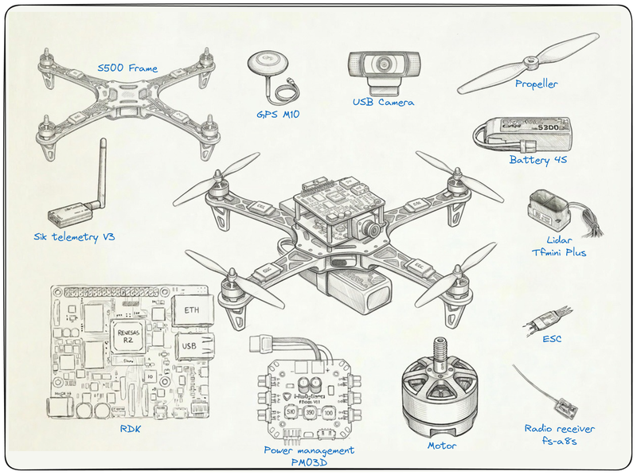
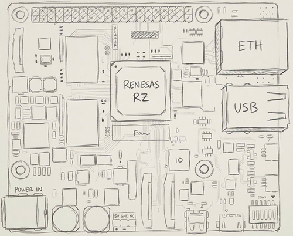
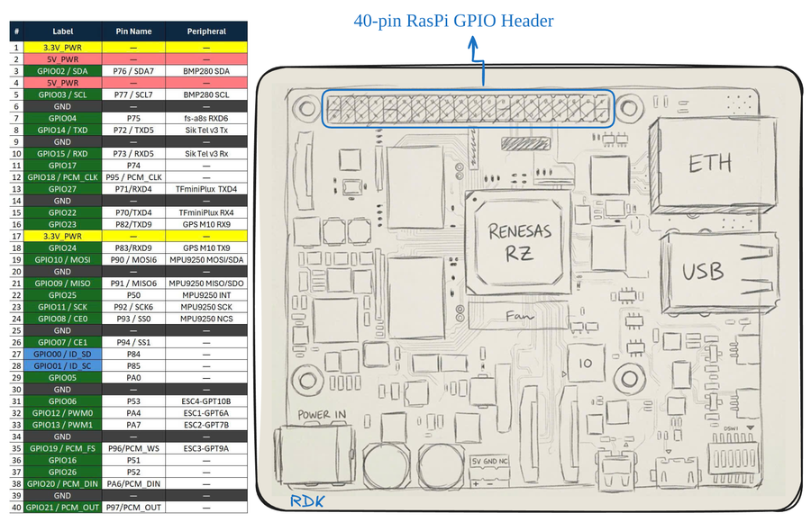
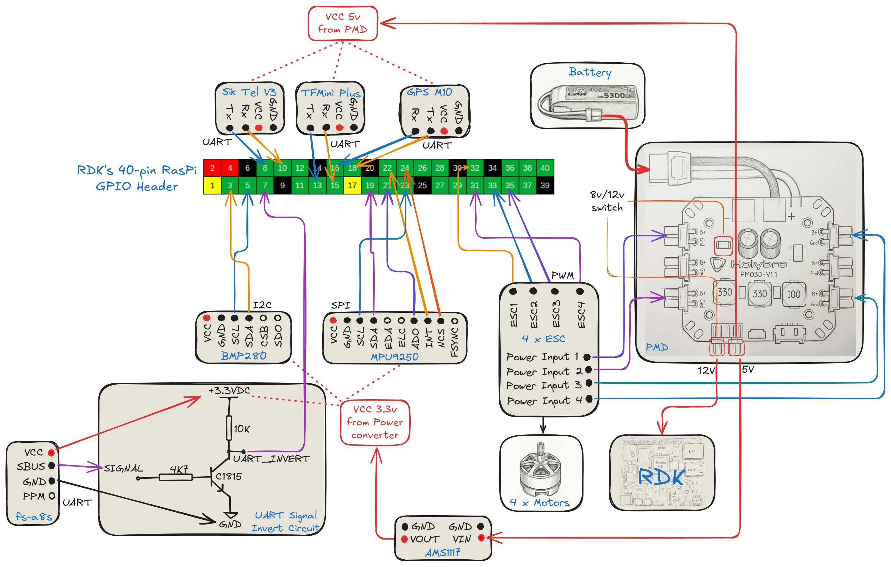

# Hardware Guide

Complete bill of materials, 40-pin GPIO pinout, and wiring for the RZ/V2H autonomous drone.

---

## Bill of Materials



| Component | Model | Qty | Notes |
|-----------|-------|-----|-------|
| **Flight Controller** | Renesas RZ/V2H RDK | 1 | Cortex-R8 (FreeRTOS/PX4) + Cortex-A55 (Linux/ROS2) |
| **Frame (Recommended)** | LX450 | 1 | Better RDK mounting compatibility |
| **Frame (Optional)** | S500 | 1 | Top plate alignment issues with RDK |
| **GPS** | u-blox M10 | 1 | UART 9600 baud (up to 18 Hz update) |
| **IMU** | MPU9250 | 1 | SPI 9-axis (accel/gyro/mag AK8963) |
| **Barometer** | BMP280 | 1 | I2C, altitude backup sensor |
| **LiDAR** | TFmini Plus | 1 | UART, primary altitude (0.1–12 m range) |
| **Telemetry** | Sik V3 433/915 MHz | 1 | MAVLink @ 57600 baud to QGC |
| **RC Receiver** | FlySky fs-a8s | 1 | SBUS (requires inverter circuit) |
| **Propeller (Recommended)** | 9450 | 4 | For LX450 frame |
| **Propeller (Optional)** | 1045 | 4 | For S500 frame |
| **ESC** | SkyWalker 40A | 4 | Electronic speed controllers |
| **Motor** | Sunny Sky X2216 1100kV | 4 | Brushless DC |
| **Camera** | Logitech C920 (USB) | 1 | CA55/Linux vision sensor |
| **Power Module** | Holybro PM03D | 1 | Power distribution + 5V regulator |
| **LiPo Battery** | 4S 5300mAh | 1 | Main power source |
| **Charger** | IMAX B6 (6A discharger) | 1 | Balance charging |
| **SBUS Inverter** | C1815 NPN transistor | 1 | Signal inversion for RC receiver |
| **Mounting Hardware** | M2.5/M3 standoffs | 1 set | Board spacing and mounting |

---

## RDK Board Overview



| Interface | Location | Usage |
|-----------|----------|-------|
| **40-pin GPIO Header** | Top edge (RPi-compatible) | All sensor I/O |
| **UART Serial** | Edge | Debug console |
| **USB** | Rear | Firmware update, logs |
| **SD Card** | Rear | U-Boot, Linux rootfs, flight logs |
| **JTAG** | Center | J-Link debugging (SEGGER RTT) |

---

## 40-Pin GPIO Pinout



**Connected pins only:**

| Pin # | RPi Label | Peripheral |
|-------|-----------|-----------|
| **3** | GPIO02/SDA | **BMP280 SDA** (I2C7) |
| **5** | GPIO03/SCL | **BMP280 SCL** (I2C7) |
| **7** | GPIO04 | **fs-a8s RX** (UART6) |
| **8** | GPIO14/TXD | **Sik TX** (UART5) |
| **10** | GPIO15/RXD | **Sik RX** (UART5) |
| **13** | GPIO27 | **TFmini TX** (UART4) |
| **15** | GPIO22 | **TFmini RX** (UART4) |
| **16** | GPIO23 | **GPS RX** (UART9) |
| **18** | GPIO24 | **GPS TX** (UART9) |
| **19** | GPIO10/MOSI | **MPU9250 MOSI** (SPI) |
| **21** | GPIO09/MISO | **MPU9250 MISO** (SPI) |
| **22** | GPIO25 | **MPU9250 INT** |
| **23** | GPIO11/SCK | **MPU9250 SCK** (SPI) |
| **24** | GPIO08/CE0 | **MPU9250 CS** (SPI) |
| **31** | GPIO06 | **ESC4 PWM** (GPT10B) |
| **32** | GPIO12/PWM0 | **ESC1 PWM** (GPT6A) |
| **33** | GPIO13/PWM1 | **ESC2 PWM** (GPT7B) |
| **35** | GPIO19/PCM_FS | **ESC3 PWM** (GPT9A) |

**UART mapping:**
- UART4 (P70/P71): TFmini → `/dev/ttyS4`
- UART5 (P72/P73): Sik Telemetry → `/dev/ttyS5`
- UART6 RX (P75): fs-a8s (SBUS) → `/dev/ttyS6`
- UART9 (P82/P83): GPS M10 → `/dev/ttyS9`

---

## Wiring



### Key Connections

**IMU (MPU9250) – SPI:**
```
VCC→RDK 3.3V (Pin1), GND→GND, SCK→Pin23, MOSI→Pin19, MISO→Pin21, INT→Pin22, CS→Pin24
```

**Barometer (BMP280) – I2C:**
```
VCC→RDK 3.3V (Pin1), GND→GND, SDA→Pin3, SCL→Pin5
```

**GPS M10 – UART:**
```
VCC→PM03D 5V, GND→GND, TX→Pin18, RX→Pin16
```

**TFmini Plus – UART:**
```
VCC→PM03D 5V, GND→GND, TX→Pin13, RX→Pin15
```

**Sik Telemetry V3 – UART:**
```
VCC→PM03D 5V, GND→GND, TX→Pin10, RX→Pin8
```

**RC Receiver (fs-a8s) – SBUS + Inverter:**
```
SBUS OUT → [NPN inverter] → Pin7 (RDK UART6)
```

**ESC PWM:**
```
ESC1→Pin32, ESC2→Pin33, ESC3→Pin35, ESC4→Pin31, GND→Pin34
```

> **Motor order**: PX4 X-configuration — Motor 1 (front-right), 2 (rear-left), 3 (front-left), 4 (rear-right)

---

## Power System

> **Power rails:**
> - **3.3V sensors** (MPU9250, BMP280): power directly from the **RDK 3.3V header pin** (Pin 1 or Pin 17) — no external regulator needed.
> - **5V peripherals** (TFmini Plus, Sik Telemetry, GPS M10, RC Receiver): power from **PM03D 5V output** directly — do **not** use the RDK 5V header rail.
> - **ESC / motors**: powered from the PM03D main battery rail.

---

## Peripheral Details

**GPS M10**: UART @ 9600 baud (default) / 115200 (configurable)
```bash
gps start -d /dev/ttyS9 -b 115200
```

**TFmini Plus**: UART @ 115200, range 0.1–12 m
```bash
tfmini start -d /dev/ttyS4
```

**MPU9250**: SPI up to 10 MHz, 3-axis accel/gyro, internal MAG (AK8963)
```bash
mpu9250 -S -R 4 -M  # -M enables internal magnetometer
```

**BMP280**: I2C @ addr 0x76/0x77, altitude backup
```bash
bmp280 start -X  # -X for external I2C
```

**Sik Telemetry**: MAVLink @ 57600 baud
```bash
# GCS connection on /dev/ttyS5
```

**fs-a8s**: SBUS (inverted UART, 100000 baud, 8E2), requires hardware inverter

---

## Build Photos

Real drone assembly and wiring details available in `assets/` directory.

---

## References

- [PX4 Hardware Setup](https://docs.px4.io/)
- [Renesas RZ/V2H](https://www.renesas.com/en/products/rz-v2h)
- [SETUP.md](SETUP.md) — Development environment and deployment
